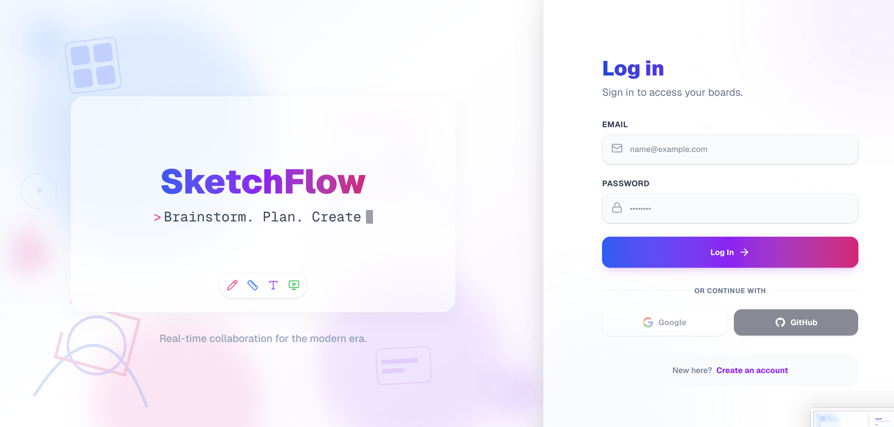
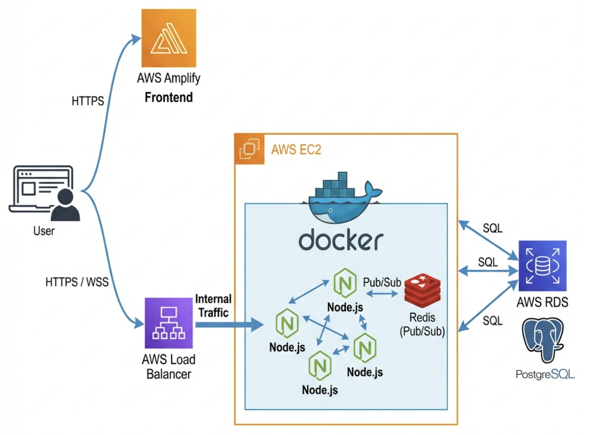

# SketchFlow - High-Performance Collaborative Whiteboard

**SketchFlow** is a distributed, real-time collaborative whiteboard platform designed for high scalability and low-latency interaction. It allows multiple users to draw, sketch, and brainstorm on shared digital canvases with instant synchronization across devices.

Built with **Next.js 14**, **Node.js**, **WebSockets**, and **Redis**, this application demonstrates a modern approach to handling stateful connections in a stateless cloud environment.


---

## 🚀 Key Features

*   **Real-Time API**: Custom WebSocket implementation (using `ws`) for sub-50ms latency updates.
*   **Multi-User Collaboration**: Live cursor tracking and concurrent drawing for unlimited users per room.
*   **Room Isolation**: Independent whiteboard sessions securely isolated by UUIDs.
*   **Smart State Management**:
    *   **Undo/Redo**: Per-user history stacks.
    *   **Persistence**: Auto-saving of strokes to PostgreSQL.
    *   **Snapshots**: Efficient loading of board state for new joiners.
*   **Authentication**: Secure JWT-based auth flow (HttpOnly cookies) with custom middleware.
*   **Responsive Design**: Fluid UI built with TailwindCSS and Glassmorphism aesthetics.

---

## 🛠 Technology Stack

### Frontend
- **Framework**: Next.js 14 (App Router)
- **Language**: TypeScript
- **Styling**: TailwindCSS
- **State**: Zustand (Local Client State)
- **Drawing Engine**: HTML5 Canvas API (Custom Engine)

### Backend
- **Runtime**: Node.js (Express)
- **Transport**: WebSockets (`ws` library) - *Chosen over Socket.io for raw performance control.*
- **Database**: PostgreSQL
- **ORM**: Prisma
- **Scaling**: Redis Pub/Sub

### Infrastructure (AWS)
- **Compute**: AWS EC2 (Dockerized Containers)
- **Traffic**: AWS Application Load Balancer (ALB)
- **Database**: AWS RDS (Managed Postgres)
- **Hosting**: AWS Amplify (Frontend CI/CD)
- **Security**: Self-Signed SSL / Reverse Proxy, JWT Authentication, Security Groups
- **IaC**: Terraform (Infrastructure as Code) configurations included.

---

## 📈 System Architecture

SketchFlow employs a **distributed, event-driven architecture** designed for high-concurrency real-time collaboration.



### Core Components workflow

1.  **Frontend Delivery**: 
    The Next.js client is delivered via **AWS Amplify** (Global CDN), ensuring low-latency initial load times.

2.  **Traffic Distribution (AWS ALB)**: 
    Incoming WebSocket connections are managed by an **Application Load Balancer**, which handles SSL termination and distributes traffic across the backend fleet.

3.  **Compute Layer (Vertical Scaling)**: 
    The backend runs on **AWS EC2** instances. Within each instance, we deploy **multiple dockerized Node.js containers**. This "Vertical Scaling" strategy maximizes the throughput of the single-threaded Node.js runtime by utilizing all available CPU cores.

4.  **Synchronization Engine (Redis Pub/Sub)**: 
    To maintain state across distributed containers, SketchFlow uses **Redis** as a real-time message bus.
    *   *Action*: When User A draws a stroke, the event is published to Redis.
    *   *Propagation*: Redis instantly broadcasts this event to all active backend containers.
    *   *Result*: Users connected to different servers receive updates in near real-time (< 50ms).

5.  **Data Persistence**: 
    Board history and user accounts are asynchronously persisted to **AWS RDS (PostgreSQL)**, decoupling storage from the real-time layer for reliability.

---

## 💻 Local Development

Run SketchFlow on your local machine without AWS dependencies.

See the full guide here: [👉 LOCAL_DEVELOPMENT.md](./LOCAL_DEVELOPMENT.md)

**Quick Start:**
```bash
# 1. Start Infrastructure (Docker)
docker run --name local-postgres -e POSTGRES_PASSWORD=password -d -p 5432:5432 postgres
docker run --name local-redis -d -p 6379:6379 redis:alpine

# 2. Install dependencies
cd backend && npm install && npx prisma db push
cd frontend && npm install

# 3. Run
# Term 1: cd backend && npm run dev
# Term 2: cd frontend && npm run dev
```

---

## 🔮 Future Roadmap

While the current version is production-grade, the following improvements are planned for Enterprise scale:

*   **S3 Snapshotting**: Currently, stroke history is replayed from SQL. For boards with 10k+ strokes, we plan to periodically dump the canvas state to a JSON file in AWS S3 for instant loading.
*   **Vector Conflict Resolution**: Implement CRDTs (Conflict-free Replicated Data Types) like Y.js for decentralized conflict handling on unreliable networks.
*   **Kubernetes (EKS)**: Migrate from raw Docker/EC2 to Kubernetes for auto-scaling capabilities based on CPU/Connection load.

---

## 📄 License

This project is open source and available under the [MIT License](LICENSE).

**Author**: [Aishwarya Virigineni]
